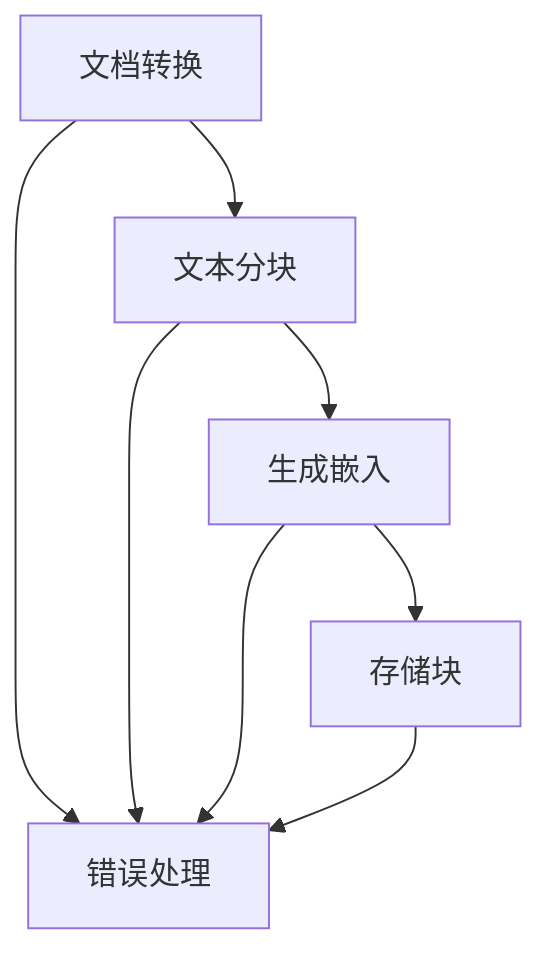
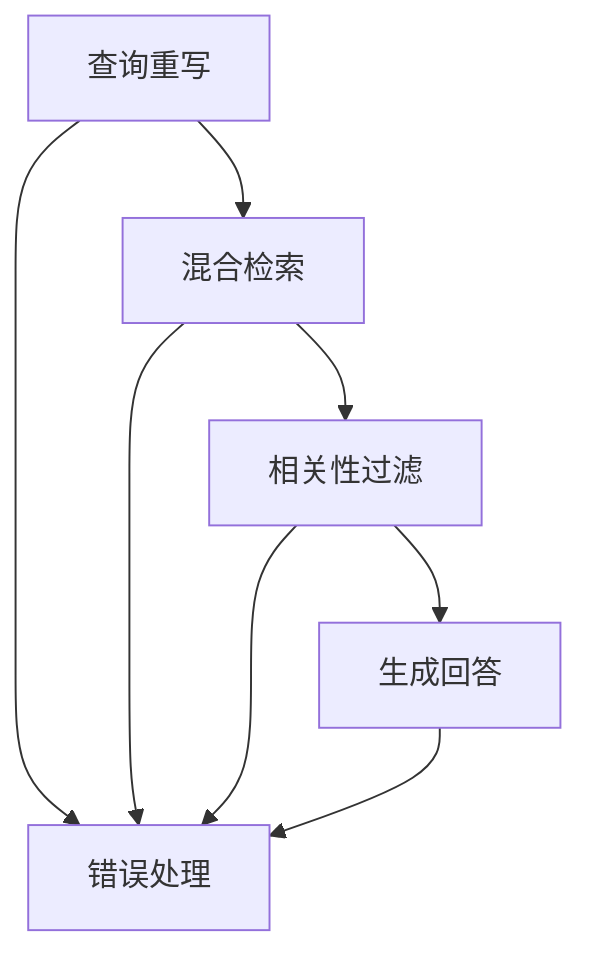

# LangGraph 实现说明

## 概述

LangGraph 是一个用于构建有状态、多步骤工作流的框架。在这个 RAG 系统中，我们使用 LangGraph 来实现**流程可控**和**步骤溯源**，解决了传统线性处理方式的问题。

## 核心价值

### 1. 流程可控 (Flow Control)
- **条件分支**：根据中间结果决定下一步执行路径
- **错误处理**：每个节点都可以处理错误并决定是否继续
- **状态管理**：维护整个流程的执行状态

### 2. 步骤溯源 (Step Tracing)
- **执行轨迹**：记录每个步骤的输入、输出、耗时
- **中间状态**：可以检查任意步骤的中间结果
- **错误诊断**：详细的错误信息和发生位置

## 实现架构

### 文档处理流程 (`core/langgraph_document_flow.py`)



**流程节点：**
1. **convert_document**: 使用 Docling 转换文档格式
2. **chunk_text**: 将文本分割成语义块
3. **generate_embeddings**: 为每个块生成向量嵌入
4. **store_chunks**: 存储到 PostgreSQL + pgvector

**状态结构：**
```python
class DocumentProcessingState(TypedDict):
    file_bytes: bytes
    filename: str
    file_type: str
    raw_text: Optional[str]
    chunks: List[str]
    embeddings: List[List[float]]
    chunk_count: int
    current_step: str
    step_history: List[Dict[str, Any]]
    errors: List[str]
    success: bool
    final_result: Optional[Dict[str, Any]]
```

### 查询处理流程 (`core/langgraph_query_flow.py`)



**流程节点：**
1. **rewrite_query**: 基于历史对话重写查询
2. **hybrid_retrieve**: 执行向量+关键词混合检索
3. **filter_chunks**: 应用相关性阈值过滤
4. **generate_response**: 生成最终回答

**状态结构：**
```python
class QueryProcessingState(TypedDict):
    user_query: str
    chat_history: List[Dict[str, str]]
    rewritten_query: Optional[str]
    retrieved_chunks: List[Dict[str, Any]]
    filtered_chunks: List[Dict[str, Any]]
    context_text: Optional[str]
    llm_response: Optional[str]
    current_step: str
    step_history: List[Dict[str, Any]]
    errors: List[str]
    success: bool
    final_response: Optional[str]
    confidence_score: Optional[float]
```

## API 接口

### 文档处理 API (`api/langgraph_demo.py`)

```python
POST /langgraph/upload-document
# 上传文档并返回完整执行轨迹

GET /langgraph/trace/{trace_id}
# 获取特定执行轨迹的详细信息

GET /langgraph/visualization/{trace_id}
# 获取流程可视化数据
```

### 查询处理 API

```python
POST /langgraph/query
# 处理查询并返回完整执行轨迹

GET /langgraph/metrics
# 获取系统性能指标
```

## 前端可视化

### 执行轨迹组件 (`frontend-app/src/LangGraphTrace.tsx`)

**功能特性：**
- 实时显示流程执行状态
- 可点击查看每个步骤的详细信息
- 支持播放/暂停执行轨迹
- 显示输入输出和错误信息

### 演示页面 (`frontend-app/langgraph-demo.html`)

**展示内容：**
- 文档处理流程演示
- 查询处理流程演示
- 传统方式 vs LangGraph 对比
- 交互式流程可视化

## 使用示例

### 文档处理

```python
from core.langgraph_document_flow import process_document_with_trace

# 处理文档并获取执行轨迹
result = process_document_with_trace(
    file_bytes=file_content,
    filename="test.pdf",
    file_type="pdf"
)

print(f"成功: {result['success']}")
print(f"结果: {result['result']}")
print(f"执行轨迹: {result['execution_trace']}")
```

### 查询处理

```python
from core.langgraph_query_flow import process_query_with_trace

# 处理查询并获取执行轨迹
result = process_query_with_trace(
    user_query="什么是机器学习？",
    chat_history=[]
)

print(f"回答: {result['response']}")
print(f"置信度: {result['confidence_score']}")
print(f"执行轨迹: {result['execution_trace']}")
```

## 执行轨迹示例

### 文档处理轨迹

```json
{
  "success": true,
  "result": {
    "filename": "test.pdf",
    "chunks_created": 8,
    "chunks_stored": 8,
    "processing_time": 4
  },
  "execution_trace": {
    "total_steps": 4,
    "steps": [
      {
        "step": "convert_document",
        "status": "success",
        "timestamp": "2024-01-15T10:30:01Z",
        "duration_ms": 1200,
        "input": {"filename": "test.pdf", "file_type": "pdf"},
        "output": {"text_length": 5000, "preview": "This is a test document..."}
      },
      {
        "step": "chunk_text",
        "status": "success",
        "timestamp": "2024-01-15T10:30:02Z",
        "duration_ms": 800,
        "input": {"text_length": 5000},
        "output": {"chunk_count": 8, "chunk_preview": "This is the first chunk..."}
      }
    ],
    "errors": [],
    "execution_time": "2024-01-15T10:30:05Z"
  }
}
```

### 查询处理轨迹

```json
{
  "success": true,
  "response": "机器学习是人工智能的一个分支...",
  "confidence_score": 0.85,
  "execution_trace": {
    "total_steps": 4,
    "steps": [
      {
        "step": "rewrite_query",
        "status": "success",
        "timestamp": "2024-01-15T10:30:01Z",
        "duration_ms": 300,
        "input": {"query": "什么是机器学习？", "history_length": 0},
        "output": {"original_query": "什么是机器学习？", "rewritten_query": "什么是机器学习？", "was_rewritten": false}
      },
      {
        "step": "hybrid_retrieve",
        "status": "success",
        "timestamp": "2024-01-15T10:30:02Z",
        "duration_ms": 800,
        "input": {"query": "什么是机器学习？"},
        "output": {"retrieved_count": 5, "has_strong_vector_match": true}
      }
    ],
    "errors": [],
    "execution_time": "2024-01-15T10:30:05Z"
  }
}
```

## 优势对比

### 传统方式的问题

- ❌ 流程是线性的，难以控制
- ❌ 无法追踪每个步骤的执行状态
- ❌ 错误处理不透明
- ❌ 难以调试和优化
- ❌ 缺乏中间状态检查
- ❌ 无法实现条件分支

### LangGraph 的优势

- ✅ 流程可控：可以定义复杂的条件分支
- ✅ 步骤溯源：每个步骤的执行状态都被记录
- ✅ 错误透明：详细的错误信息和处理路径
- ✅ 易于调试：可以检查任意中间状态
- ✅ 可观测性：完整的执行轨迹和性能指标
- ✅ 可回滚：支持流程的暂停和恢复

## 部署说明

1. **安装依赖**：
   ```bash
   pip install langgraph
   ```

2. **启动服务**：
   ```bash
   python main.py
   ```

3. **访问演示页面**：
   ```
   http://localhost:8000/langgraph-demo.html
   ```

4. **API 测试**：
   ```bash
   # 文档处理
   curl -X POST "http://localhost:8000/langgraph/upload-document" \
        -F "file=@test.pdf" \
        -F "file_type=pdf"
   
   # 查询处理
   curl -X POST "http://localhost:8000/langgraph/query" \
        -H "Content-Type: application/json" \
        -d '{"query": "什么是机器学习？"}'
   ```

## 总结

LangGraph 的实现为 RAG 系统带来了：

1. **真正的流程可控**：可以定义复杂的条件分支和错误处理
2. **完整的步骤溯源**：每个步骤的执行状态都被详细记录
3. **强大的可观测性**：可以实时监控和调试整个流程
4. **灵活的扩展性**：可以轻松添加新的节点和条件逻辑

这解决了传统线性处理方式的所有问题，为 RAG 系统提供了企业级的可靠性和可维护性。
