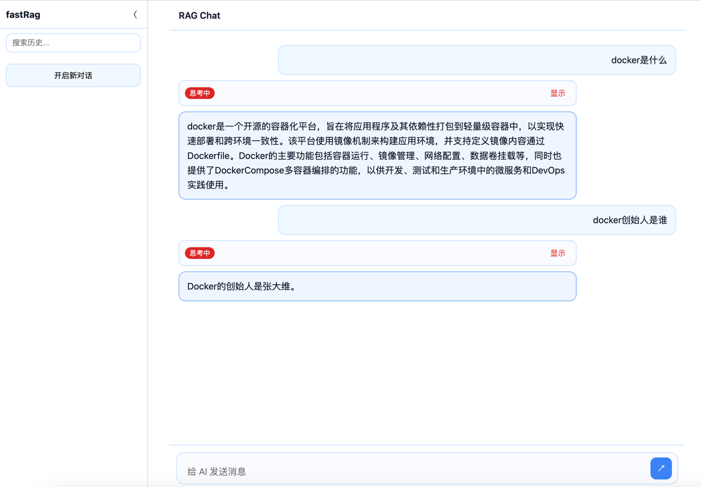

#### chat robot with rag prefer

### 🌟 Main Features

- **📊 Vector Database**: PgVector  for efficient semantic search
- **🔄 Real-time Communication**: SSE (Server-Sent Events) for streaming responses
- **🌐 Frontend**: React  + Vite + TS 

####  Vector Database 

PgVector ，vector serach support
since 2019 ，截至2025年，最新版本0.8.0支持高达16000维的向量存储，以及HNSW、IVFFlat等多种索引类型，在保持PostgreSQL ACID特性的同时，为AI应用提供了高性能的向量相似度搜索能力。

#### docling  智能文本解析

