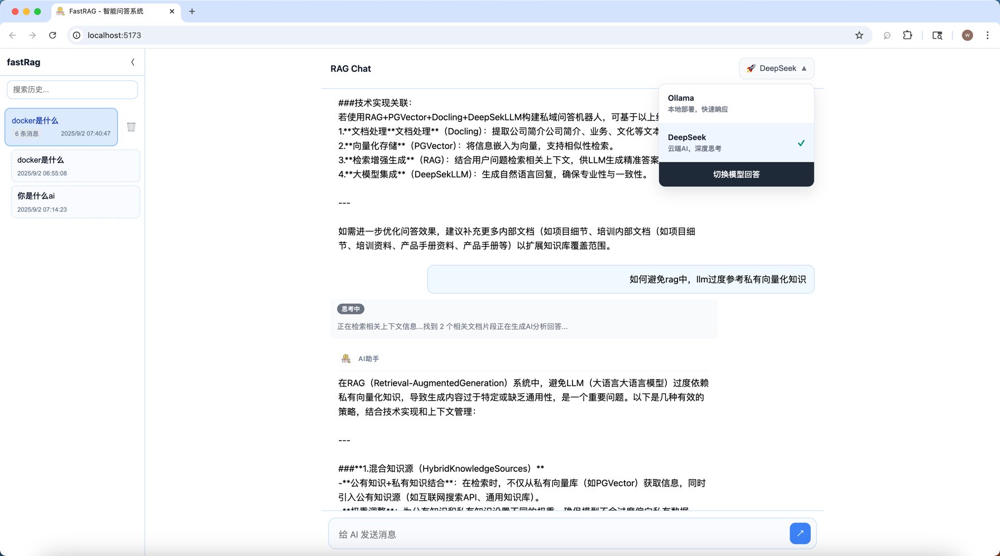
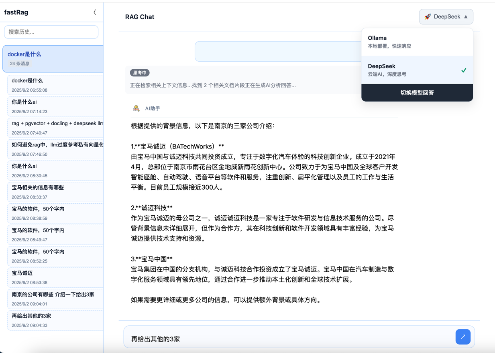
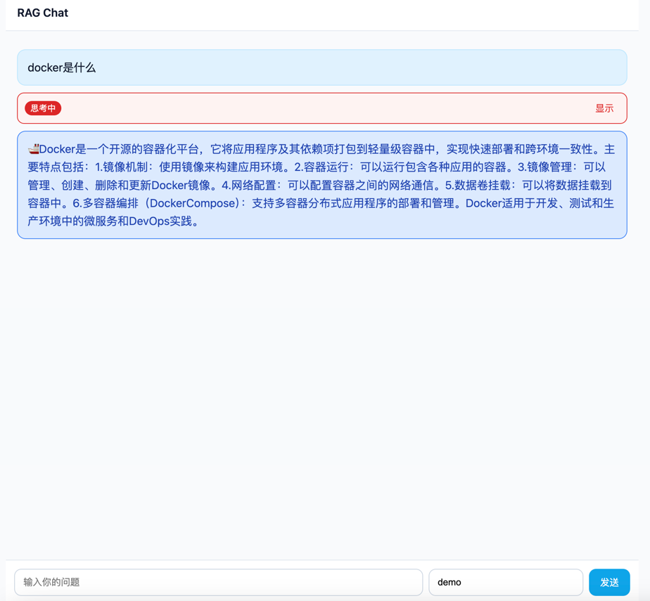
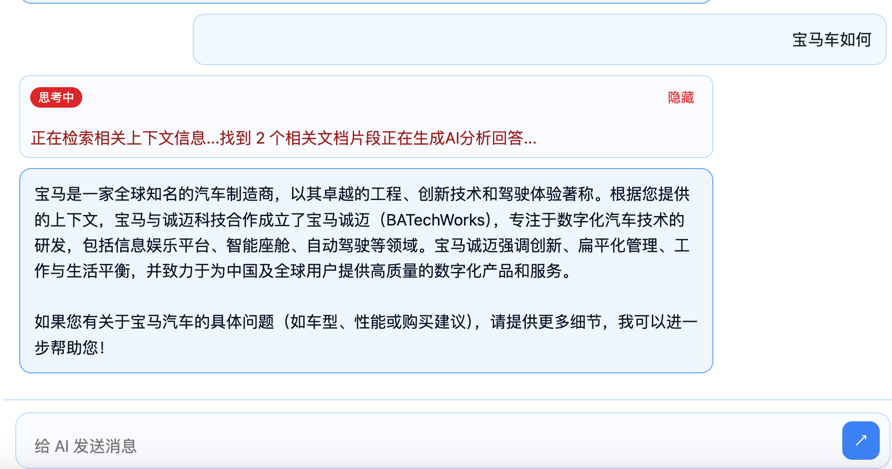
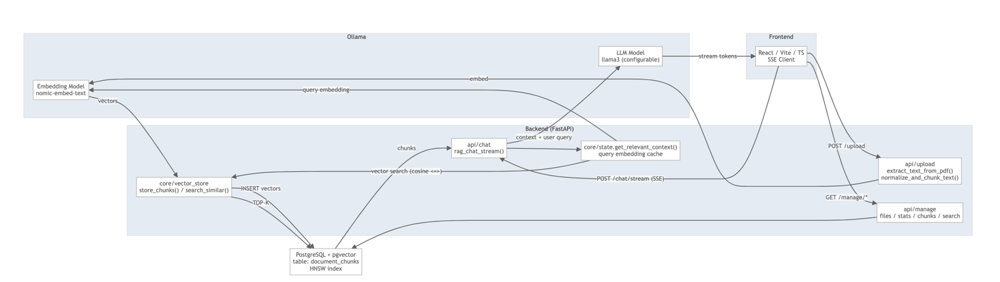

# Fast RAG

[中文](README.zh-CN.md) | English

> Local, privacy-first RAG using PostgreSQL + pgvector and Ollama. Streams responses via SSE. Simple, fast, hackable.


<p>
  <a href="https://www.python.org/"></a>
  <a href="https://fastapi.tiangolo.com/"></a>
  <a href="https://www.postgresql.org/"></a>
  <a href="https://github.com/pgvector/pgvector"></a>
  <a href="https://github.com/docling-project/docling"></a>
  <a href="https://www.postgresql.org/docs/current/pgtrgm.html"></a>
  <a href="#rag"></a>
  <a href="https://www.docker.com/"></a>
  <a href="LICENSE"></a>
</p>









## Features
- Process management 【LangGraph】
- Documents transform core tools 【Docling】、supprt PDF、DOCX、PPTX、Image、HTML、AsciiDoc、Markdown
- Semantic search with pgvector (768-dim `nomic-embed-text`)
- Streaming responses via SSE
- Optional frontend: React + Vite + TypeScript
- Local models via Ollama or openai api
- Fast ingestion: normalize → sentence chunk → batch embed → insert
- Manage corpus via REST (list, stats, chunks, search, delete)


## Architecture



## Table of Contents
- [Local Setup](#local-setup)
- [Run](#run)
- [Frontend (optional)](#frontend-optional)
- [License](#license)

---


- env configure


---

## Local Setup
```bash
pip install -r requirements.txt
docling-tools models download 
cp env.example .env   # edit DB_* for your environment
#python scripts/init_db.py   # if not using docker init
```

---

## Run
```bash
python main.py
```
App: http://localhost:8000
- Swagger UI: http://localhost:8000/docs
- ReDoc: http://localhost:8000/redoc

---

## Frontend 


React + Vite + TypeScript app lives in `frontend-app/`.

Dev
```bash
cd frontend-app
npm install          # or: pnpm i / yarn
npm run dev          # http://localhost:5173
```

---


## License
MIT. See `LICENSE`.


