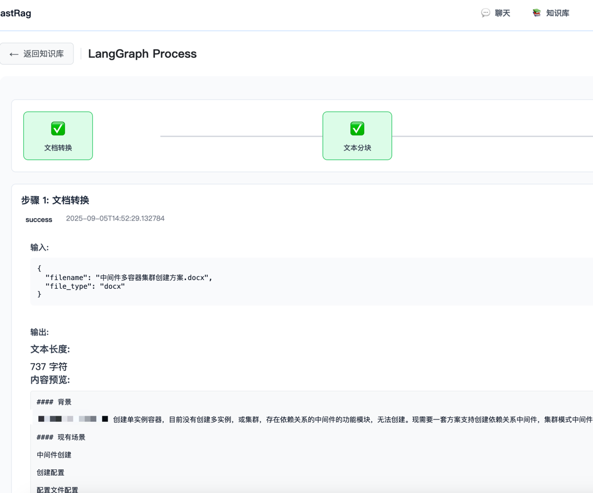

# Fast RAG（中文）

[English](README.MD) | 中文

> 本地、隐私优先的 RAG 系统：基于 PostgreSQL + pgvector 与 Ollama，使用 SSE 流式输出；简单、快速、可定制。

<p>
  <a href="https://www.python.org/"></a>
  <a href="https://fastapi.tiangolo.com/"></a>
  <a href="https://www.postgresql.org/"></a>
  <a href="https://github.com/pgvector/pgvector"></a>
  <a href="https://github.com/docling-project/docling"></a>
  <a href="https://www.postgresql.org/docs/current/pgtrgm.html"></a>
  <a href="https://www.docker.com/"></a>
  <a href="LICENSE"></a>
</p>





## 功能特性
- 流程管理：支持 LangGraph 可视化与执行轨迹持久化
- 文档转换：Docling 支持 PDF、DOCX、PPTX、图片、HTML、AsciiDoc、Markdown
- 语义检索：pgvector（默认 768 维 `nomic-embed-text`）
- REST + SSE 流式响应
- 可选前端：React + Vite + TypeScript
- 模型：本地 Ollama 或兼容 OpenAI API 的云端模型


## 目录
- [本地安装](#本地安装)
- [运行](#运行)
- [前端（可选）](#前端可选)
- [License](#license)

---

### 环境配置
- 后端环境变量示例见 `env.example`，复制为 `.env` 并按需修改（数据库、模型、日志等）
- 前端在 `frontend-app/.env` 配置：
  ```
  VITE_API_BASE=http://localhost:8000
  ```

---

## 本地安装
```bash
pip install -r requirements.txt
docling-tools models download 
cp env.example .env   # 配置 DB_* 等环境变量
# 如果不使用 docker 初始化，可运行：
# python scripts/init_db.py
```

---

## 运行
```bash
python main.py
```
服务地址：`http://localhost:8000`
- Swagger UI: `http://localhost:8000/docs`
- ReDoc: `http://localhost:8000/redoc`

---

## 前端（可选）

前端位于 `frontend-app/`（React + Vite + TypeScript）。

开发
```bash
cd frontend-app
npm install          # 或 pnpm i / yarn
npm run dev          # http://localhost:5173
```

构建
```bash
cd frontend-app
npm run build
npm run preview      # 预览 dist/
```

提示
- 如后端不在本机或端口不同，更新 `VITE_API_BASE`。
- 后端默认允许通配 CORS（见 `main.py`）。

---

## License
MIT，详见 `LICENSE`。
